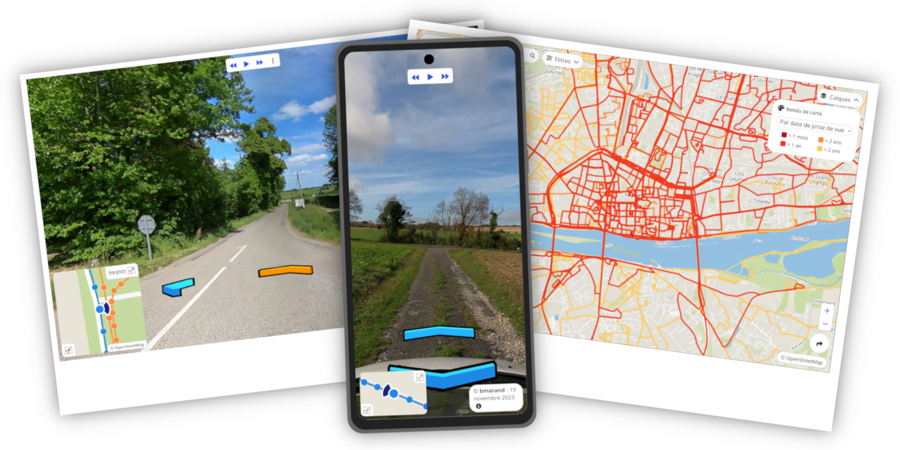

# Web viewer documentation

Welcome to Panoramax __Web Viewer__ documentation ! It will help you through all phases of setup, run and develop on Panoramax JS pictures viewer.



!!! note

	If at some point you're lost or need help, you can contact us through [issues](https://gitlab.com/panoramax/clients/web-viewer/-/issues) or by [email](mailto:panieravide@riseup.net).

## Install the viewer

Many options are available for installing the viewer.

=== ":simple-npm: NPM"

	Panoramax viewer is available on NPM as [@panoramax/web-viewer](https://www.npmjs.com/package/@panoramax/web-viewer) package.

	```bash
	npm install @panoramax/web-viewer
	```

	If you want the latest version (corresponding to the `develop` git branch), you can use the `develop` NPM dist-tag:

	```bash
	npm install @panoramax/web-viewer@develop
	```

=== ":material-web: Hosted"

	You can rely on various providers offering hosted NPM packages, for example JSDelivr.

	```html
	<!-- You may use another version than 3.0.2, just change the release in URL -->
	<link rel="stylesheet" type="text/css" href="https://cdn.jsdelivr.net/npm/@panoramax/web-viewer@3.0.2/build/index.css" />
	<script src="https://cdn.jsdelivr.net/npm/@panoramax/web-viewer@3.0.2/build/index.js"></script>
	```

=== ":material-code-tags: Source code"

	You can install and use Panoramax web client based on code provided in this repository.

	This library relies on __Node.js 16__, which should be installed on your computer. Then, you can build the library using these commands:

	```bash
	git clone https://gitlab.com/panoramax/clients/web-viewer.git
	cd web-viewer/
	npm install
	npm build
	```


## Basic usage

First, you need to make sure everything is ready to create the viewer:

=== ":fontawesome-brands-js: Old-school JS"

	Make sure to have both JS and CSS code available in your HTML `head` part:

	```html
	<!-- Change the actual path depending of where you installed the library -->
	<link rel="stylesheet" type="text/css" href="web-viewer/build/index.css" />
	<script src="web-viewer/build/index.js"></script>
	```

	And you also node a `div` somewhere in your HTML:

	```html
	<div id="viewer" style="width: 500px; height: 300px"></div>
	```

	Then, the div is populated with this JavaScript code:

	```js
	let myViewer = new Panoramax.Viewer(
		"viewer",  // Div ID
		"https://api.panoramax.xyz/api",  // STAC API endpoint
		{ map: true }  // Viewer options
	);
	```

=== ":fontawesome-brands-node-js: New-style JS"

	Make sure to import both JS and CSS in your code:

	```js
	import Panoramax from '@panoramax/web-viewer';
	import '@panoramax/web-viewer/build/index.css';
	```

	And have access in some way to a classic `div` HTML element:

	```js
	const myDiv = document.getElementById("viewer");
	```

	Then, the div is populated with this JavaScript code:

	```js
	let myViewer = new Panoramax.Viewer(
		myDiv,  // Div Element
		"https://api.panoramax.xyz/api",  // STAC API endpoint
		{ map: true }  // Viewer options
	);
	```


Beyond classic viewer, other widgets are available and [can be tested online](https://viewer.geovisio.fr/):

__Standalone-map__

A simple map for showing coverage only.

```js
var myMap = new Panoramax.StandaloneMap(
	"map",  // Div ID
	"https://api.panoramax.xyz/api"  // STAC API endpoint
);
```

__Editor__

A map and photo viewer, focused on a single sequence, for previewing edits made to it.

```js
var myEditor = new Panoramax.Editor(
	"editor",  // Div ID
	"https://api.panoramax.xyz/api",  // STAC API endpoint
	{
		selectedSequence: "id-to-an-existing-sequence", // Sequence ID (mandatory)
		selectedPicture: "id-to-a-picture-in-this-sequence" // Picture ID (optional)
	}
);
```

## User interface

### Keyboard shortcuts

All interactions with the viewer can be done using the mouse, and some can be also done using keyboard.

* __Arrows__ (or 2/4/8/6 on keypad): move inside the picture, or move the map
* __Page up/down__ (or 3/9 on keypad) : go to next or previous picture in sequence
* __+ / -__ : zoom picture or map in or out
* __*__ (or 5 on keypad) : move picture or map to its center
* __Home / ↖️__ (or 7 on keypad) : switch map and picture as main shown component
* __End__ (or 1 on keypad) : hide minimized map or picture
* __Space__ : play or pause current sequence
