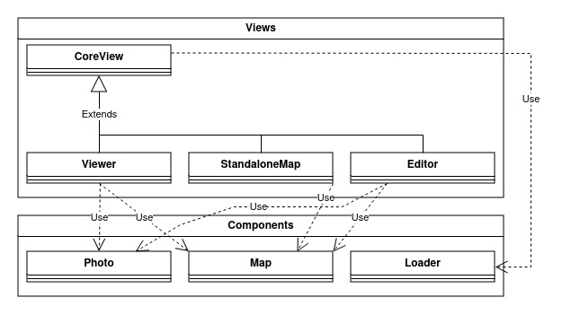

# Developing on the client

You want to work on our library and offer bug fixes or new features ? That's awesome ! 🤩

Here are some inputs about working with Panoramax web client code.

If something seems missing or incomplete, don't hesitate to contact us by [email](mailto:panieravide@riseup.net) or using [an issue](https://gitlab.com/panoramax/clients/web-viewer/-/issues). We really want Panoramax to be a collaborative project, so everyone is welcome (see our [code of conduct](https://gitlab.com/panoramax/clients/web-viewer/-/blob/develop/CODE_OF_CONDUCT.md)).

## Architecture

The current code is split between various elements:

- __Views__: a single functional entry, like _Viewer_ (map + picture), _StandaloneMap_ or _Editor_. They share parts of code in _CoreView_ class. They specialized the behaviour of components depending on the needs.
- __Components__: reusable elements, like _Map_, _Photo_ or _Loader_. They are used in some views depending of the context.
- __Utils__: utility functions, splitted in various files for clarity (_API, I18n, Map, Utils, Widgets_).



The library is relies on various other libraries:

- [Photo Sphere Viewer](https://github.com/mistic100/Photo-Sphere-Viewer), for displaying classic and 360° pictures
- [Maplibre GL JS](https://github.com/maplibre/maplibre-gl-js), for displaying the map which shows sequences and pictures location
- [JS Library Boilerplate](https://github.com/hodgef/js-library-boilerplate), for having a ready-to-use development toolbox


## Testing

We're trying to make Panoramax as reliable and secure as possible. To ensure this, we rely heavily on code testing. A variety of testing tools is made available:

* `npm start` : launches a dev web server on [localhost:3000](http://localhost:3000)
* `npm run test` : unit testing
* `npm run lint` : syntax checks
* `npm run coverage` : amount of tested code

If you're working on bug fixes or new features, please __make sure to add appropriate tests__ to keep Panoramax level of quality.


## Documentation

Documentation is offered through two means in this repository:

- Code itself is documented with [JSDoc comments](https://jsdoc.app/about-getting-started)
- A broader doc is available in `docs` folder

The code documentation can be generated using the following command:

```bash
npm run doc
```

That will update the `docs/02_Usage.md` file with all functions and parameters.

The broader doc can be served and viewed using [Mkdocs](https://www.mkdocs.org/):

```bash
pip install mkdocs mkdocs-material
mkdocs serve
```

## Make a release

See [dedicated documentation](./90_Releases.md).
